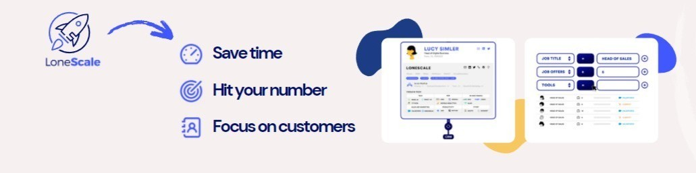

# @lonescale/n8n-nodes-trigger

This is an n8n community node. It lets you use LoneScale Trigger in your n8n workflows.

LoneScale Trigger allows you to directly launch workflow from your LoneScale results

[n8n](https://n8n.io/) is a [fair-code licensed](https://docs.n8n.io/reference/license/) workflow automation platform.

[Installation](#installation)  
[Operations](#operations)  
[Credentials](#credentials) 
[Compatibility](#compatibility)  
[Resources](#resources)  

## Installation

Follow the [installation guide](https://docs.n8n.io/integrations/community-nodes/installation/) in the n8n community nodes documentation.

## Operations

Select one of your LoneScale workflow

## Credentials

Add ApiKey from your LoneScale [account](https://app.lonescale.com/app/user)

## Compatibility

Tested on v0.208.0

## Resources

* [n8n community nodes documentation](https://docs.n8n.io/integrations/community-nodes/)
* [loneScale help center](https://help-center.lonescale.com/en/)

